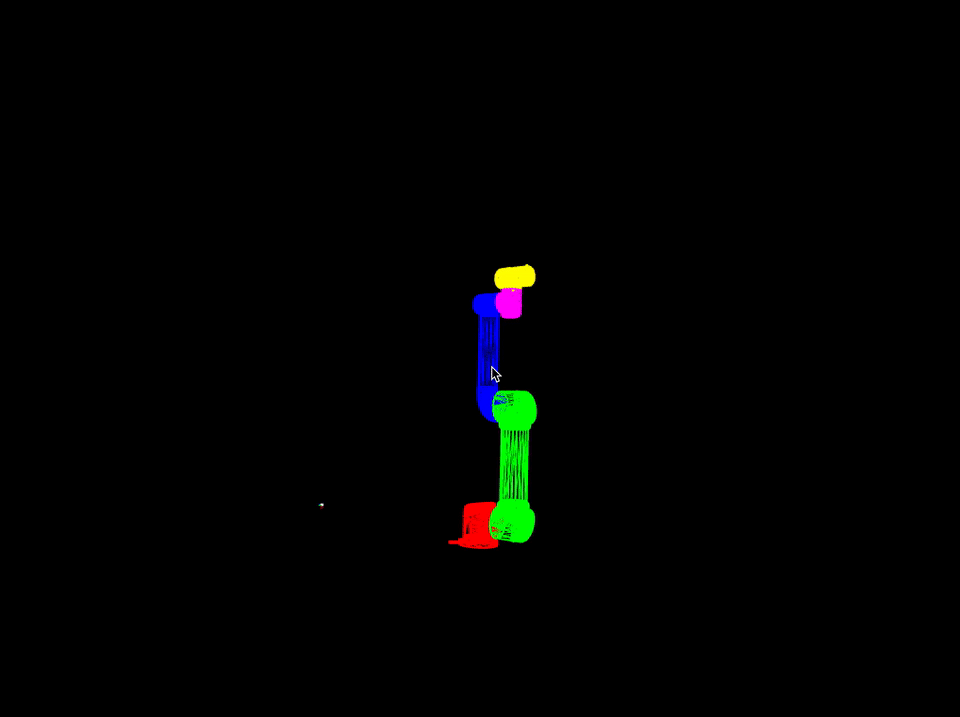

### Robotic Arm Research @ [The Frank-Ratchye STUDIO for Creative Inquiry](http://studioforcreativeinquiry.org/)

#### urModernDriverTest

This app is a stripped down version of Universal Robots' ur_modern_driver package for ROS. This is the start of an openFrameworks addon to wrap the driver.
ofxURDriver is coming Spring 2016.

#### UR5KinematicModel

This app is test app for the KinematicModel of the UR5 robot arm.  It visualizes how the robot arm moves.

#### WorldCalibration 

This app calibrations the world

- UR5
- OptiTrack Mocap System (via NatNet)
- KinectV2 Skeleton/Depth/RGB

### READING MATERIAL
[Script Manual](https://s3-eu-west-1.amazonaws.com/ur-support-site/18679/scriptmanual_en.pdf)
[UR Kinematics](https://smartech.gatech.edu/bitstream/handle/1853/50782/ur_kin_tech_report_1.pdf)
[UR Report](http://orbit.dtu.dk/files/117833332/Universal_Robot_report.pdf)

_All Apps are built against openFrameworks master branch_

_living on the bleeding edge!_
 
